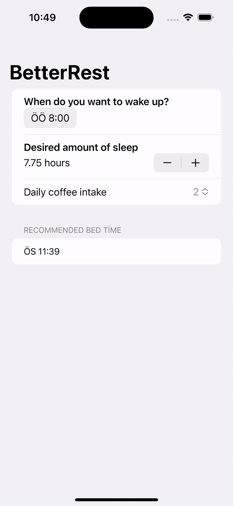

#  BetterRest

It’s designed to help coffee drinkers get a good night’s sleep by asking them three questions.
 

<li>When do they want to wake up?</li>
<li>Roughly how many hours of sleep do they want?</li>
<li>How many cups of coffee do they drink per day?</li>

 

Once we have those three values, we’ll feed them into <b><i>Core ML</i></b> to get a result telling us when they ought to go to bed

